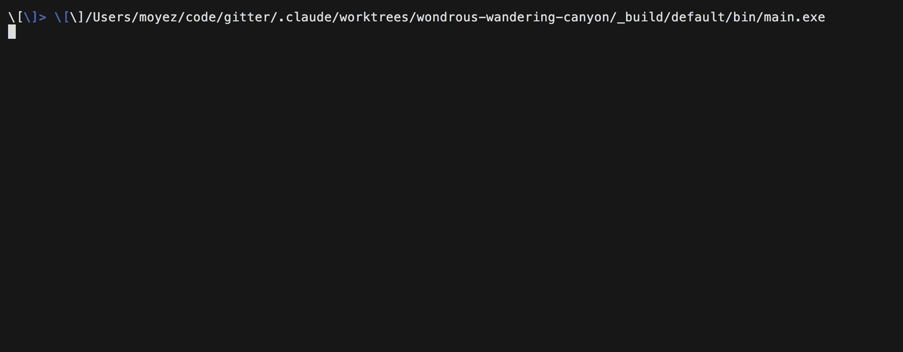

# gitter

A git TUI for reviewing stacked branches, written in OCaml with
[bonsai_term](https://github.com/janestreet/bonsai_term) — Jane Street's
Bonsai, the incremental UI library behind their web frontends, targeting the
terminal.

`SPEC.md` is the design doc: the problem, the decisions and why they were
made, and the open questions. It is a working document and stays current.

<!-- Recorded at 2x by scripts/demo/record; width halves it back so it stays
     sharp on HiDPI instead of being resampled by the browser. -->


## Why

Once code is committed, most git TUIs stop helping. They show you the working
tree. They do not show you the diff of your branch against the branch it sits
on, and they do not remember what you have already read.

That is the whole job here. Reviewing a stack — increasingly, a stack written
by an agent — is the thing gitter is built for. Staging is table stakes and
works fine, but it is not the point.

## What it does

There are two modes.

**Work.** Staged and unstaged files, with the diff beside them. Stage or
unstage whole files, or single hunks from inside the diff.

**Review.** The diff of your branch against any base in the stack. Files carry
a reviewed mark, and the section title shows how many are done.

The stack comes from git alone — no Graphite metadata, no config file, no state
directory. Branch parents are inferred from the commit DAG plus recent reflog
tips, which is what keeps a child attached to a parent that was amended. A
branch whose parent has moved out from under it is marked `needs restack`.

Reviewed marks are keyed on the pair of blob hashes for a file, so a mark
records the exact diff you read. It survives a restack that does not touch the
file, and clears itself the moment either side changes. Marks live in a SQLite
database in the git common dir, so they are shared across worktrees and
invisible to the working tree.

Also:

- Syntax highlighting from tree-sitter, compiled into the binary. 16 vendored
  grammars cover 31 file extensions; OCaml and JSON come from the tree-sitter
  package. Nothing is shelled out to.
- A shell overlay on `Ctrl-T`, running `$SHELL` in the repo root. gitter
  reloads git state when you leave it.
- A which-key menu on `Space`, and a command palette on `?` inside it.
- Panes resize by dragging, zoom to fill the screen, and can be hidden.

## Built with

- **[bonsai_term](https://github.com/janestreet/bonsai_term)** — Bonsai for the
  terminal. Every pane is a component with its own state; there is no shared
  model and no god handler. `SPEC.md` has the widget contract.
- **[OxCaml](https://oxcaml.org)** — bonsai_term needs it, for labeled tuples
  and stack-allocation modes. That is a custom compiler, which is why the
  releases are binaries.
- **[tree-sitter](https://tree-sitter.github.io)** — statically linked.
  Grammars are vendored per language and their upstream `highlights.scm` is
  used verbatim, predicates and all. `scripts/add-grammar` does the whole job:
  fetch, generate the library, regenerate the extension registry, build, test.
- **libvterm** — the shell overlay is a real terminal emulator, not a pty
  passthrough.
- **SQLite** — review marks.

libvterm and SQLite are linked statically. The shipped binary loads nothing
outside `/usr/lib`, so there is no runtime to install.

## Install

macOS on Apple Silicon, or Linux on x86_64 or arm64 — see
[Limitations](#limitations).

macOS, via the tap:

```sh
brew install MoyezM/tap/gitter
```

macOS or Linux:

```sh
curl -fsSL https://raw.githubusercontent.com/MoyezM/gitter/main/scripts/install.sh | bash
```

or take a tarball from the [releases page](https://github.com/MoyezM/gitter/releases).

The published builds are `macos-arm64`, `linux-x86_64` and `linux-arm64`.

Prebuilt binaries only. Building from source needs a custom compiler; see
[Building](#building).

## Keys

Run gitter in a git repo. The status bar shows the keys for whatever pane has
focus.

| Key | Where | Does |
| --- | --- | --- |
| `Tab` | anywhere | next pane |
| `Space` | anywhere | menu |
| `?` | in the menu | command palette |
| `Ctrl-T` | anywhere | shell overlay, and back |
| `Ctrl-C` | anywhere | quit |
| `j` `k` | file lists, stack | move |
| `h` `l` | file lists, stack | fold, unfold |
| `s` `u` | file lists | stage, unstage |
| `d` | file lists | discard |
| `c` | file lists | commit |
| `r` | review mode | toggle reviewed |
| `y` | file lists, diff | copy path |
| `j` `k` | diff | scroll |
| `n` `p` | diff | page |
| `h` `l` | diff | pan |
| `s` `u` | diff | stage, unstage the hunk |
| `Enter` | stack | set that branch as the base |

Menu paths worth knowing: `Space w r` review layout, `Space w w` work layout,
`Space w z` zoom, `Space g t` shell, `Space g c` commit.

## Limitations

Worth knowing before you install:

- No Intel macOS build. Linux ships for x86_64 and arm64, but against glibc
  2.35, so anything older cannot run it — and musl distributions such as
  Alpine are out entirely, because the OxCaml toolchain does not support them.
- The binary is large — the vendored grammars are most of it.
- Truecolor is assumed. Terminals without it have no fallback yet.
- A fresh clone has no reflog, so the stack degrades to a flat list of trunk
  children until you restack once.

`TECH_DEBT.md` has the current list, with the fix sketch for each.

## Building

The OxCaml switch is the whole difficulty. It lives at `5.2.0+ox`:

```sh
opam switch create 5.2.0+ox --repos ox=git+https://github.com/oxcaml/opam-repository.git,default
opam install bonsai_term bonsai_term_components ocaml-lsp-server
```

`scripts/bootstrap` does this for you. System dependencies come from the nix
dev shell in `flake.nix`; `.envrc` activates both via direnv (`direnv allow`
once), which also points your editor at the OxCaml-built `ocamllsp`. Without
direnv, prefix commands with `opam exec --switch=5.2.0+ox --`.

```sh
dune exec bin/main.exe        # run it
dune runtest                  # tests
scripts/build-release         # the artifact the release workflow ships
```

## Demo

The GIF above is a build output, not a hand-driven screen recording:

```sh
nix develop path:. -c ./scripts/demo/record
```

That generates a throwaway repo with a branch stack, drives gitter through
`scripts/demo/hero.tape`, and checks the recorded frames before it will
overwrite the GIF.

## Layout

- `bin/` — the app
- `lib/` — panes, layout, git, terminal, highlighting
- `grammars/` — vendored tree-sitter grammars, added by `scripts/add-grammar`
- `scripts/demo/` — the README recording
